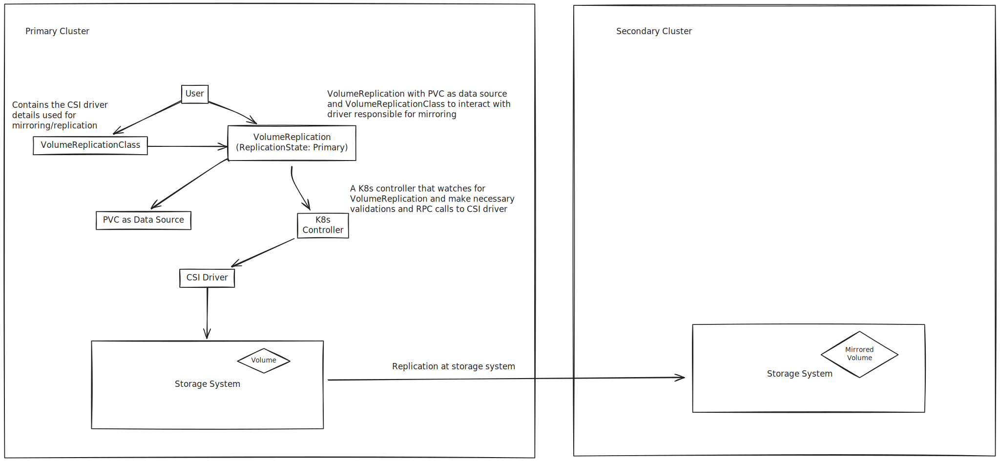

# Summary

This document discusses the csi-addons API that allows replication of volumes to another peer cluster.

## Terminologies

For the sake of simplicity, we will be using some abbreviations in the document which are as follows:

- VR - VolumeReplication
- VRC - VolumeReplicationClass
- K8s - Kubernetes
- DR - Disaster Recovery
- PVC - Persistent Volume Claim
- PV - Persistent Volume
- Primary - Cluster where the applications are currently running
- Secondary - Cluster where the application data is being replicated

## Motivation

Most of the storage vendors provide a mechanism to replicate data to other nodes, clusters, peers in order to achieve crash consistency for the data stored on the volumes. But, there are no K8s APIs that provide crash consistency at real time. We have K8s VolumeGroupSnapshot APIs provided but that again involves adding another application to take backup and restore it on the secondary cluster.
Therefore, there was a need to have K8s APIs that provide replication of volumes and a group of volumes at real time to provide support for Disaster Recovery (DR).

## Goal

- Provide APIs to support replication of a group of volumes.

## Design for VolumeReplication

This section discusses the API definition, implementation nuances of VolumeReplication (VR) and VolumeReplicationClass (VRC).

VolumeReplication is a namespaced scope resource that contains reference to a storage object (a PVC) and VolumeReplicationClass corresponding to the driver providing replication. VR contains the details that explains which PVC is being replicated and what’s the current status of replication along with errors, if any.

VolumeReplicationClass (VRC) is a cluster scoped resource that contains driver related configuration parameters required for replication. It is similar to the definition of a StorageClass (SC) in K8s but crafted for VolumeReplication.

### Implementation/Workflow Details



To start with, users should create the VRC which contains the provisioner (csi driver) that supports mirroring capability and the volumes (PVCs) should be created using the same provisioner. Also, add the necessary parameters required by the storage vendor to mirror the volume to a peer cluster like the secret name, namespace.

To start replication of the volume, the user needs to create a VR that contains the PVC as the dataSource which would be mirrored/replicated to a peer cluster, along with other required fields like the volumeReplicationClass (shared below) and the desired replicationState of the VR.
The VR supports PVC and VolumeGroupReplication as the `dataSource` and the storage vendor is responsible for adding necessary checks to validate that if the dataSource is a single volume or a volumegroup and proceed accordingly. `replicationState` is used to determine if the VR is replicating to a secondary cluster i.e. `primary` or is on replicating end of the mirroring i.e. `secondary`.

If DR orchestrator is being used to manage DR for the workloads then, the storage vendor needs to add the below set of `Status` and `status.Conditions` to the VR for the orchestrator to read the VR status and perform failover/relocate on the workload properly.

### VolumeReplication Status Examples

The following sections provide detailed examples of VolumeReplication status for different replication states. Each status example includes the necessary conditions and state information that a DR orchestrator uses to manage disaster recovery operations.
The condition's `Reason`, `Status`, and `Type` and the `status.State` must match the patterns shown below for a DR orchestrator to correctly identify and manage the replication state.

#### Primary Status

**Description:** The Primary status indicates that the volume is actively serving I/O operations and is replicating data to a secondary cluster. This is the active state where the volume is being written to by applications, and changes are being mirrored to the secondary site for disaster recovery purposes. The volume is healthy and not in a degraded or resyncing state.

Sample `status` of VR when the volume is promoted to `Primary` successfully:

```yaml
status:
  conditions:
    - message: volume is promoted to primary and replicating to secondary
      reason: Promoted
      status: "True"
      type: Completed
    - message: volume is healthy
      reason: Healthy
      status: "False"
      type: Degraded
    - message: volume is not resyncing
      reason: NotResyncing
      status: "False"
      type: Resyncing
    - message: volume is validated and met all prerequisites
      reason: PrerequisiteMet
      status: "True"
      type: Validated
    - message: "volume is replicating: local image is primary"
      reason: Replicating
      status: "True"
      type: Replicating
  lastCompletionTime: "2026-02-17T07:41:58Z"
  lastSyncBytes: 9793536
  lastSyncDuration: 0s
  lastSyncTime: "2026-02-17T07:40:01Z"
  message: volume is marked primary
  state: Primary
```

#### Secondary Status

**Description:** The Secondary status indicates that the volume is in a read-only state and is receiving replicated data from the primary cluster. The volume is not actively serving application I/O but is being kept in sync with the primary volume. This state is typical for the standby cluster in a disaster recovery setup.
The volume is marked as degraded because it's in secondary mode and not available for writes.

Sample `status` of VR when the volume is demoted to `Secondary`:

```yaml
status:
  conditions:
    - message: volume is demoted to secondary
      reason: Demoted
      status: "True"
      type: Completed
    - message: volume is degraded
      reason: VolumeDegraded
      status: "True"
      type: Degraded
    - message: volume is not resyncing
      reason: NotResyncing
      status: "False"
      type: Resyncing
    - message: volume is validated and met all prerequisites
      reason: PrerequisiteMet
      status: "True"
      type: Validated
  lastCompletionTime: "2026-02-17T07:41:58Z"
  message: volume is marked secondary
  state: Secondary
```

#### Demoted Status

**Description:** The Demoted status represents a transitional state where a volume that was previously Primary has been demoted. This typically occurs during a planned failover or relocate operation. The volume is no longer accepting writes and is in a degraded state. This is similar to the Secondary status but explicitly indicates the demotion operation has been completed.

Sample `status` of VR when the volume is `Demoted`:

```yaml
status:
  conditions:
    - message: volume is demoted to secondary
      reason: Demoted
      status: "True"
      type: Completed
    - message: volume is degraded
      reason: VolumeDegraded
      status: "True"
      type: Degraded
    - message: volume is not resyncing
      reason: NotResyncing
      status: "False"
      type: Resyncing
  lastCompletionTime: "2026-02-17T07:42:15Z"
  message: volume is marked secondary
  state: Secondary
```

#### Resyncing Status

**Description:** The Resyncing status indicates that the volume is actively synchronizing data between the primary and secondary sites. This state occurs when replication has been interrupted (due to network issues, cluster downtime, or other failures) and the volumes are now catching up.
During resyncing, the volume is marked as degraded and the Resyncing condition is set to True. The volume may experience degraded performance as it transfers the delta of changes that occurred during the interruption.

Sample `status` of VR when the volume is `Resyncing`:

```yaml
status:
  conditions:
    - message: volume is demoted to secondary
      reason: Demoted
      status: "True"
      type: Completed
    - message: volume is degraded
      reason: VolumeDegraded
      status: "True"
      type: Degraded
    - message: volume is resyncing changes from primary to secondary
      reason: ResyncTriggered
      status: "True"
      type: Resyncing
  lastCompletionTime: "2026-02-17T07:40:00Z"
  lastSyncBytes: 5242880
  lastSyncDuration: 15s
  lastSyncTime: "2026-02-17T07:42:30Z"
  message: volume is resyncing
  state: Secondary
```

## Disaster Recovery Workflows

This section describes the workflows for performing disaster recovery operations using VolumeReplication with a DR orchestrator. These workflows explain how to perform failover (unplanned recovery) and relocate (planned migration) operations, along with the conditions that must be met before proceeding.

### Failover Workflow

**Failover** is an unplanned disaster recovery operation performed when the primary cluster becomes unavailable due to failure, network partition, or other catastrophic events. The goal is to quickly restore application availability on a surviving secondary cluster.

#### Prerequisites for Failover

Before initiating a failover operation, verify the following conditions:

1. **Primary Cluster Unavailable**: The primary cluster is confirmed to be down or unreachable
2. **Secondary Cluster Healthy**: The secondary cluster is operational and accessible
3. **VolumeReplication Exists**: A VolumeReplication resource must exist on the secondary cluster (see note below)
4. **VolumeReplication Status**: The VR on the secondary cluster should show one of these states:
   - `state: Secondary` with `Degraded: True` and `Completed: True`
   - `state: Secondary` with `Resyncing: True` (data may be slightly out of sync)

**Important Note**: The VolumeReplication resource might not be created on the secondary cluster in some deployment scenarios. If the VR does not exist on the secondary cluster, you must create it before proceeding with the failover. The VR should reference the same PVC name and use the appropriate VolumeReplicationClass with `replicationState: secondary`.

#### Failover Steps

1. **Verify or Create VolumeReplication on Secondary Cluster**

Check if VolumeReplication exists on the secondary cluster:

```bash
kubectl get volumereplication <vr-name> -n <namespace>
```

If the VR does not exist, create it:

```yaml
apiVersion: replication.storage.openshift.io/v1alpha1
kind: VolumeReplication
metadata:
  name: <vr-name>
  namespace: <namespace>
spec:
  volumeReplicationClass: <vrc-name>
  replicationState: secondary
  dataSource:
    kind: PersistentVolumeClaim
    name: <pvc-name>
```

Apply the VR:

```bash
kubectl apply -f volumereplication.yaml
```

Wait for the VR to be created and reach a stable secondary state before proceeding.

2. **Verify Secondary Cluster Status**

Check the VolumeReplication status on the secondary cluster:

```bash
kubectl get volumereplication <vr-name> -n <namespace> -o yaml
```

Ensure the status shows:

```yaml
status:
  conditions:
    - type: Completed
      status: "True"
      reason: Demoted
    - type: Degraded
      status: "True"
      reason: VolumeDegraded
  state: Secondary
```

3. **Promote Secondary to Primary**

Update the VolumeReplication on the secondary cluster to promote it to primary:

```bash
kubectl patch volumereplication <vr-name> -n <namespace> --type merge -p '{"spec":{"replicationState":"primary"}}'
```

4. **Wait for Promotion to Complete**

Monitor the VR status until it shows successful promotion:

```yaml
status:
  conditions:
    - type: Completed
      status: "True"
      reason: Promoted
    - type: Degraded
      status: "False"
      reason: Healthy
    - type: Resyncing
      status: "False"
      reason: NotResyncing
    - type: Replicating
      status: "True"
      reason: Replicating
  state: Primary
```

**Wait Condition**: Do not proceed until `Completed: True`, `Degraded: False`, and `state: Primary` are confirmed.

5. **Verify Application Readiness**

Once the volume is promoted to primary: - Ensure the PVC is bound and accessible - Verify that applications can mount and write to the volume - Check that replication to a new secondary (if configured) is functioning

#### Failover Considerations

- **VR Creation**: Always verify that VolumeReplication exists on the secondary cluster before attempting failover. If it doesn't exist, create it with `replicationState: secondary` first
- **Data Loss Risk**: If the secondary was in `Resyncing` state during failover, some data written to the primary after the last successful sync may be lost
- **Split-Brain Prevention**: Ensure the failed primary cluster is properly fenced before promoting the secondary to prevent split-brain scenarios
- **RamenDR Integration**: When using RamenDR, it automatically handles VR creation, state transitions, and ensures proper sequencing of operations

### Relocate Workflow

**Relocate** is a planned migration operation that moves the application workload from one cluster to another. This is typically performed for maintenance, load balancing, or returning to a preferred cluster after a failover (failback).

#### Prerequisites for Relocate

Before initiating a relocate operation, verify the following conditions:

1. **Both Clusters Healthy**: Both source (current primary) and target (current secondary) clusters are operational
2. **VolumeReplication Exists**: VolumeReplication resources must exist on both clusters
3. **Replication Healthy**: The VR on the primary cluster shows healthy replication status
4. **No Resyncing**: The secondary cluster is fully synchronized (not in resyncing state)
5. **Application Quiesced**: Applications should be in a quiesced state or stopped to ensure data consistency

**Important Note**: Similar to failover, the VolumeReplication resource might not exist on the target secondary cluster. If it doesn't exist, create it with `replicationState: secondary` before proceeding with the relocate operation.

#### Relocate Steps

1. **Verify or Create VolumeReplication on Both Clusters**

Check if VolumeReplication exists on both primary and secondary clusters:

```bash
# On primary cluster
kubectl get volumereplication <vr-name> -n <namespace>

# On secondary cluster
kubectl get volumereplication <vr-name> -n <namespace>
```

If the VR does not exist on the secondary cluster, create it following the same process as described in the Failover workflow step 1.

2. **Verify Primary Cluster Status**

Check the VolumeReplication status on the current primary cluster:

```bash
kubectl get volumereplication <vr-name> -n <namespace> -o yaml
```

Ensure healthy replication:

```yaml
status:
  conditions:
    - type: Completed
      status: "True"
      reason: Promoted
    - type: Degraded
      status: "False"
      reason: Healthy
    - type: Resyncing
      status: "False"
      reason: NotResyncing
    - type: Replicating
      status: "True"
      reason: Replicating
  state: Primary
```

**Wait Condition**: Ensure `Degraded: False` and `Resyncing: False` before proceeding.

3. **Verify Secondary Cluster Status**

Check the VolumeReplication status on the target secondary cluster:

```bash
kubectl get volumereplication <vr-name> -n <namespace> -o yaml
```

Ensure it's synchronized:

```yaml
status:
  conditions:
    - type: Completed
      status: "True"
      reason: Demoted
    - type: Degraded
      status: "True"
      reason: VolumeDegraded
    - type: Resyncing
      status: "False"
      reason: NotResyncing
  state: Secondary
```

**Wait Condition**: Ensure `Resyncing: False` to confirm data is fully synchronized.

4. **Quiesce Application (if applicable)**

Stop or quiesce the application on the primary cluster to ensure no new writes occur during the transition:

```bash
kubectl scale deployment <app-deployment> -n <namespace> --replicas=0
```

5. **Perform Final Sync**

Wait for any final data synchronization to complete. Monitor the `lastSyncTime` in the VR status to ensure recent synchronization.

6. **Demote Primary to Secondary**

Update the VolumeReplication on the current primary cluster:

```bash
kubectl patch volumereplication <vr-name> -n <namespace> --type merge -p '{"spec":{"replicationState":"secondary"}}'
```

Wait for demotion to complete:

```yaml
status:
  conditions:
    - type: Completed
      status: "True"
      reason: Demoted
    - type: Degraded
      status: "True"
      reason: VolumeDegraded
  state: Secondary
```

**Wait Condition**: Ensure `Completed: True` and `state: Secondary` before proceeding.

7. **Promote Secondary to Primary**

Update the VolumeReplication on the target cluster:

```bash
kubectl patch volumereplication <vr-name> -n <namespace> --type merge -p '{"spec":{"replicationState":"primary"}}'
```

Wait for promotion to complete:

```yaml
status:
  conditions:
    - type: Completed
      status: "True"
      reason: Promoted
    - type: Degraded
      status: "False"
      reason: Healthy
    - type: Replicating
      status: "True"
      reason: Replicating
  state: Primary
```

**Wait Condition**: Ensure `Completed: True`, `Degraded: False`, and `state: Primary` before starting applications.

8. **Start Application on New Primary**

Deploy or scale up the application on the new primary cluster:

```bash
kubectl scale deployment <app-deployment> -n <namespace> --replicas=<desired-count>
```

9. **Verify Application Health**

Confirm that: - Applications are running and healthy - PVCs are bound and accessible - Data is being written successfully - Replication to the new secondary is active

#### Relocate Considerations

- **VR Creation**: Always verify that VolumeReplication exists on both clusters before attempting relocate. Create missing VRs with appropriate `replicationState` values
- **Zero Data Loss**: When performed correctly with proper synchronization checks, relocate operations should result in zero data loss
- **Planned Downtime**: Applications will experience downtime during the transition. Plan the relocate during a maintenance window
- **Rollback Plan**: Have a rollback plan ready in case issues arise during the relocate operation
- **RamenDR Integration**: RamenDR automates the entire relocate workflow, including VR creation, application quiescing, VR state transitions, and application restart

### Key Status Conditions to Monitor

When performing failover or relocate operations, always monitor these critical conditions:

| Condition Type | Status  | Meaning                                                                |
| -------------- | ------- | ---------------------------------------------------------------------- |
| `Completed`    | `True`  | The last replication operation (promote/demote) completed successfully |
| `Degraded`     | `False` | Volume is healthy and available for I/O (Primary state)                |
| `Degraded`     | `True`  | Volume is in read-only or unavailable state (Secondary state)          |
| `Resyncing`    | `False` | Volume is fully synchronized with its peer                             |
| `Resyncing`    | `True`  | Volume is actively catching up with changes from the peer              |
| `Replicating`  | `True`  | Volume is actively replicating data to the peer (Primary only)         |
| `Validated`    | `True`  | Volume has passed all prerequisite checks                              |

### Troubleshooting

**Issue**: VR does not exist on secondary cluster

- **Cause**: VR was not created during initial setup or was deleted
- **Resolution**: Create the VR manually with `replicationState: secondary` referencing the correct PVC and VolumeReplicationClass

**Issue**: VR stuck in `Resyncing: True` state

- **Cause**: Network issues, storage backend problems, or large data delta
- **Resolution**: Check network connectivity, verify storage backend health, monitor `lastSyncBytes` and `lastSyncDuration` for progress

**Issue**: Promotion fails with validation errors

- **Cause**: Prerequisites not met, storage backend issues
- **Resolution**: Check the `Validated` condition message for specific prerequisite failures

**Issue**: Application cannot access volume after promotion

- **Cause**: PVC not bound, node affinity issues, or storage driver problems
- **Resolution**: Verify PVC status, check node labels, review CSI driver logs

## API definition of VolumeReplication (VR) CRD

- [VR Type Definition](https://github.com/csi-addons/kubernetes-csi-addons/blob/main/api/replication.storage/v1alpha1/volumereplication_types.go)
- [VR CRD Definition](https://github.com/csi-addons/kubernetes-csi-addons/blob/main/config/crd/bases/replication.storage.openshift.io_volumereplications.yaml)

## API definition of VolumeReplicationClass (VR) CRD

- [VRClass Type Definition](https://github.com/csi-addons/kubernetes-csi-addons/blob/main/api/replication.storage/v1alpha1/volumereplicationclass_types.go)
- [VRClass CRD Definition](https://github.com/csi-addons/kubernetes-csi-addons/blob/main/config/crd/bases/replication.storage.openshift.io_volumereplicationclasses.yaml)

## Example YAML files

- VolumeReplicationClass CR:

```yaml
apiVersion: replication.storage.openshift.io/v1alpha1
kind: VolumeReplicationClass
metadata:
  name: volumereplicationclass-sample
spec:
  provisioner: example.provisioner.io
  parameters:
    replication.storage.openshift.io/replication-secret-name: secret-name
    replication.storage.openshift.io/replication-secret-namespace: secret-namespace
    # schedulingInterval is a vendor specific parameter. It is used to set the
    # replication scheduling interval for storage volumes that are replication
    # enabled using related VolumeReplication resource
    schedulingInterval: 1m
```

- VolumeReplication CR:

```yaml
apiVersion: replication.storage.openshift.io/v1alpha1
kind: VolumeReplication
metadata:
  name: volumereplication-sample
  namespace: default
spec:
  volumeReplicationClass: volumereplicationclass-sample
  replicationState: primary
  replicationHandle: replicationHandle # optional
  dataSource:
    kind: PersistentVolumeClaim
    name: myPersistentVolumeClaim # should be in same namespace as VolumeReplication
```
