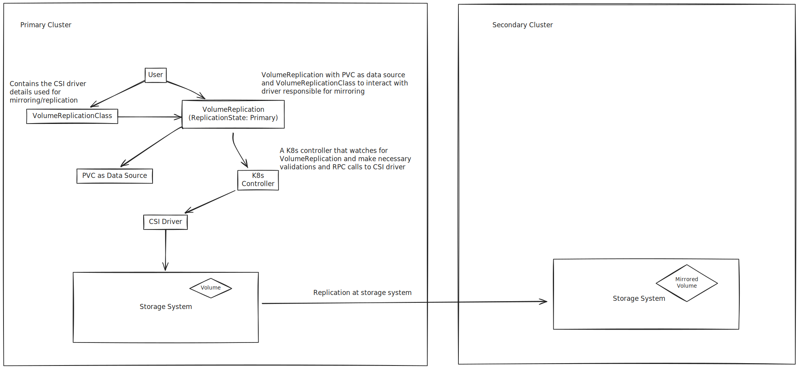

# Summary

This document discusses the csi-addons API that allows replication of volumes to another peer cluster.

## Terminologies

For the sake of simplicity, we will be using some abbreviations in the document which are as follows:

- VR - VolumeReplication
- VRC - VolumeReplicationClass
- K8s - Kubernetes
- DR - Disaster Recovery
- PVC - Persistent Volume Claim
- PV - Persistent Volume
- Primary - Cluster where the applications are currently running
- Secondary - Cluster where the application data is being replicated

## Motivation

Most of the storage vendors provide a mechanism to replicate data to other nodes, clusters, peers in order to achieve crash consistency for the data stored on the volumes. But, there are no K8s APIs that provide crash consistency at real time. We have K8s VolumeGroupSnapshot APIs provided but that again involves adding another application to take backup and restore it on the secondary cluster.
Therefore, there was a need to have K8s APIs that provide replication of volumes and a group of volumes at real time to provide support for Disaster Recovery (DR).

## Goal

- Provide APIs to support replication of a group of volumes.

## Design for VolumeReplication

This section discusses the API definition, implementation nuances of VolumeReplication (VR) and VolumeReplicationClass (VRC).

VolumeReplication is a namespaced scope resource that contains reference to a storage object (a PVC) and VolumeReplicationClass corresponding to the driver providing replication. VR contains the details that explains which PVC is being replicated and what’s the current status of replication along with errors, if any.

VolumeReplicationClass (VRC) is a cluster scoped resource that contains driver related configuration parameters required for replication. It is similar to the definition of a StorageClass (SC) in K8s but crafted for VolumeReplication.

### Implementation/Workflow Details



To start with, users should create the VRC which contains the provisioner (csi driver) that supports mirroring capability and the volumes (PVCs) should be created using the same provisioner. Also, add the necessary parameters required by the storage vendor to mirror the volume to a peer cluster like the secret name, namespace.

To start replication of the volume, the user needs to create a VR that contains the PVC as the dataSource which would be mirrored/replicated to a peer cluster, along with other required fields like the volumeReplicationClass (shared below) and the desired replicationState of the VR.
The VR supports PVC and VolumeGroupReplication as the `dataSource` and the storage vendor is responsible for adding necessary checks to validate that if the dataSource is a single volume or a volumegroup and proceed accordingly. `replicationState` is used to determine if the VR is replicating to a secondary cluster i.e. `primary` or is on replicating end of the mirroring i.e. `secondary`.

## API definition of VolumeReplication (VR) CRD

- [VR Type Definition](https://github.com/csi-addons/kubernetes-csi-addons/blob/main/api/replication.storage/v1alpha1/volumereplication_types.go)
- [VR CRD Definition](https://github.com/csi-addons/kubernetes-csi-addons/blob/main/config/crd/bases/replication.storage.openshift.io_volumereplications.yaml)

## API definition of VolumeReplicationClass (VR) CRD

- [VRClass Type Definition](https://github.com/csi-addons/kubernetes-csi-addons/blob/main/api/replication.storage/v1alpha1/volumereplicationclass_types.go)
- [VRClass CRD Definition](https://github.com/csi-addons/kubernetes-csi-addons/blob/main/config/crd/bases/replication.storage.openshift.io_volumereplicationclasses.yaml)

## Example YAML files

- VolumeReplicationClass CR:

```yaml
apiVersion: replication.storage.openshift.io/v1alpha1
kind: VolumeReplicationClass
metadata:
  name: volumereplicationclass-sample
spec:
  provisioner: example.provisioner.io
  parameters:
    replication.storage.openshift.io/replication-secret-name: secret-name
    replication.storage.openshift.io/replication-secret-namespace: secret-namespace
    # schedulingInterval is a vendor specific parameter. It is used to set the
    # replication scheduling interval for storage volumes that are replication
    # enabled using related VolumeReplication resource
    schedulingInterval: 1m
```

- VolumeReplication CR:

```yaml
apiVersion: replication.storage.openshift.io/v1alpha1
kind: VolumeReplication
metadata:
  name: volumereplication-sample
  namespace: default
spec:
  volumeReplicationClass: volumereplicationclass-sample
  replicationState: primary
  replicationHandle: replicationHandle # optional
  dataSource:
    kind: PersistentVolumeClaim
    name: myPersistentVolumeClaim # should be in same namespace as VolumeReplication
```
